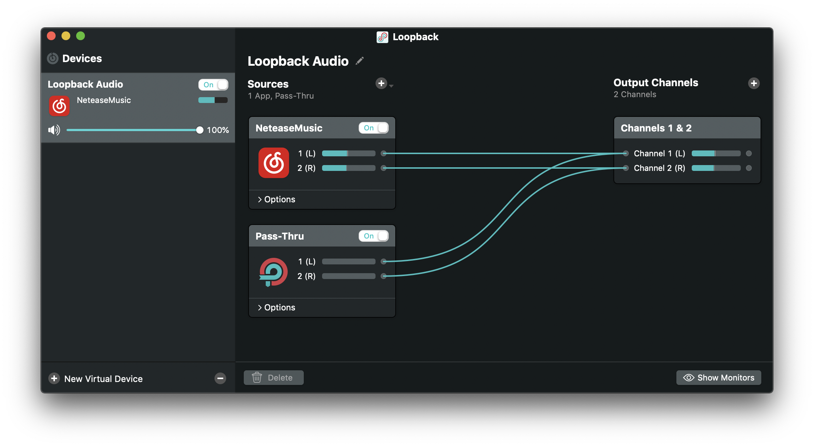

# loophack
Hack Loopback



## Dependency
- [insert_dylib_rs](https://github.com/BlueCocoa/insert_dylib_rs)
- Or [insert_dylib](https://github.com/Tyilo/insert_dylib)

## Compile
```bash
# libloophack.dylib will be placed in `build/Release`
xcodebuild

# Or
clang -shared -undefined dynamic_lookup -Os -o libloophack.dylib loophack/loophack.mm
```

## Install
1. Place `libloophack.dylib` in `/Applications/Loopback.app/Contents/Frameworks/`

2. Insert dylib
```bash
cd /Applications/Loopback.app/Contents/MacOS/

# insert_dylib_rs
insert_dylib --binary Loopback --dylib @rpath/libloophack.dylib
# insert_dylib
insert_dylib --all-yes @rpath/libloophack.dylib Loopback

# substitute orginal binary
mv Loopback Loopback_original
mv Loopback_patched Loopback
```
